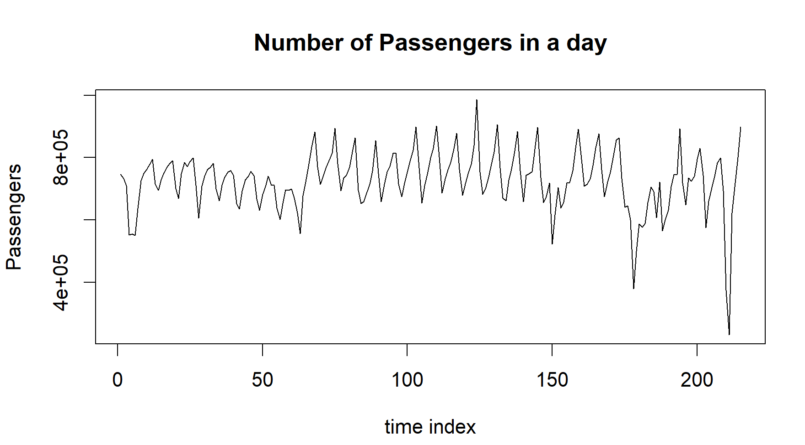
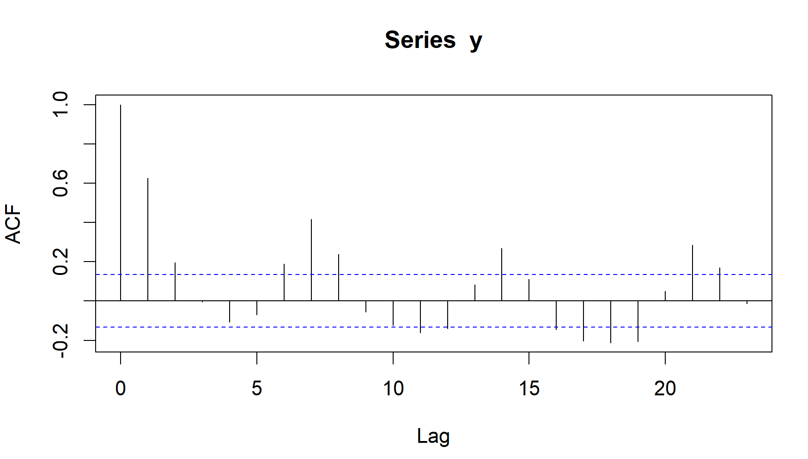
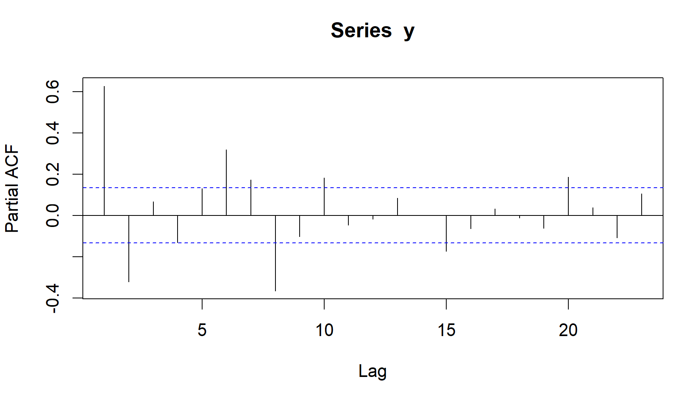
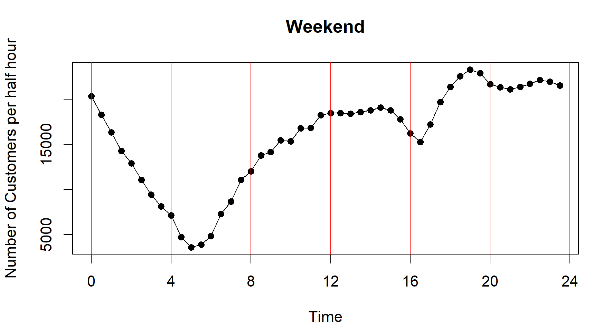
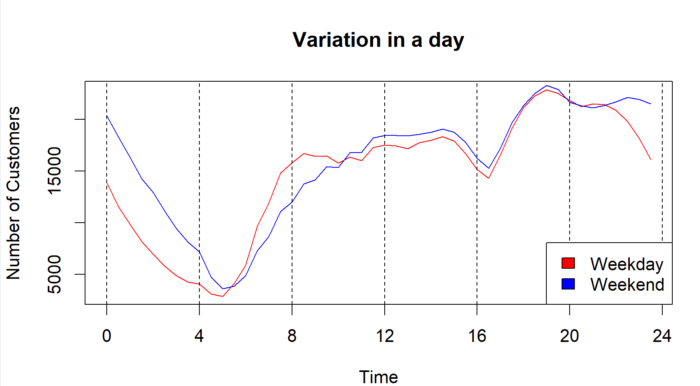
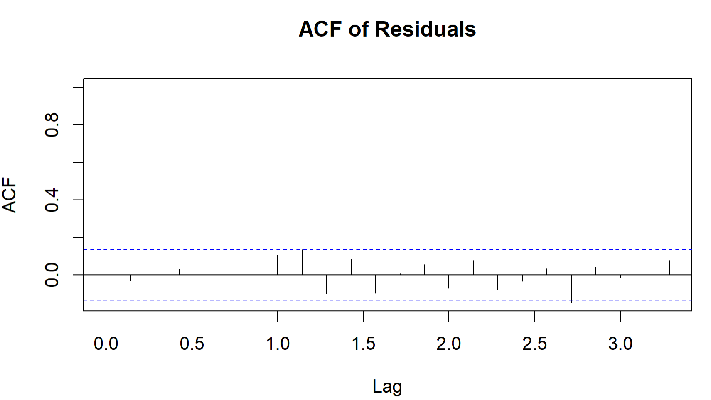
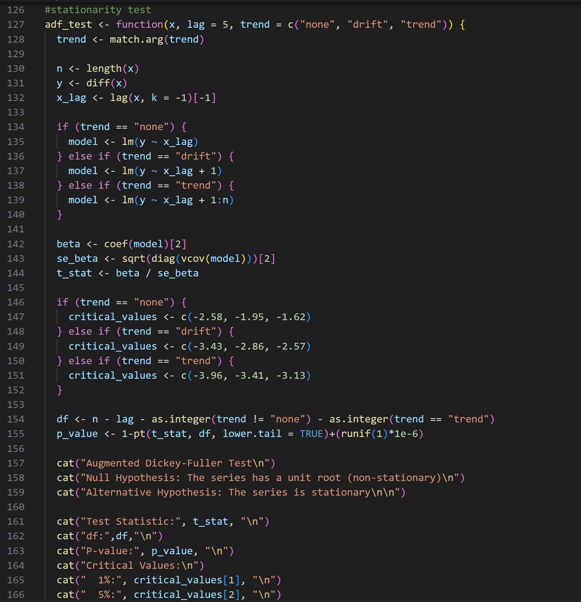

# Anomaly Detection in Time Series

**Instructor:** Dr. Buddhananda Banerjee  
  
- Sparsh Burman (20MA20057)  
 

## 1. Anomaly Detection: Motivation

Anomaly detection is crucial in data science and machine learning, particularly for identifying data points that deviate from expected patterns. Time Series Analysis is widely applicable across industries such as finance, healthcare, astronomy, and weather forecasting. Thus, detecting anomalies in time series data is essential for various applications.

## 2. Procedure

Steps for anomaly detection in our project include:

- Rearranging data on a daily basis.
- Checking and removing trends from data.
- Detecting and removing seasonality.
- Performing residual analysis.
- Assessing data stationarity.
- Fitting an ARIMA model to determine appropriate lag values for autoregressive and moving average processes.
- Identifying anomalies based on a predefined threshold.

## 3. Experiments and Results

### New York Taxi Dataset
This dataset records the number of taxis used from July 2014 to January 2015, with data points every half-hour. We addressed two main questions:

#### Problem 1:
Identify outlier days where taxi usage was abnormally high or low.

#### Problem 2:
Determine optimal work hours for taxi drivers on weekdays and weekends.

For daily aggregation, we averaged the half-hourly data across each day.

#### Visualizations
- Day-wise Taxi Usage
- 

### Trend and Seasonality Analysis
We used non-parametric methods like the relative ordering test to analyze trends and the Friedman test for seasonality.

### Fitting an ARIMA Model
To accommodate the data's seasonality, we incorporated a Fourier series within the ARIMA model, avoiding direct seasonal adjustments.

### Figures
- ACF and PACF plots to set non-seasonal ARIMA parameters.
- 
- 

## 4. Outlier Detection
After model fitting, we standardized residuals and conducted hypothesis testing to identify total anomalies over the period.

### Visualization of Anomalies
- 

## 5. Results of Problem 2
We analyzed and visualized taxi demand to recommend the best operational hours for drivers.

### Traffic Patterns
- Weekday and Weekend Customer Traffic
- 
- 

## 6. Conclusions
Our analysis revealed that anomalies often coincided with significant events such as holidays or severe weather conditions, affecting taxi usage.

## Appendices
### A. Custom Function Implementations
Functions for Augmented Dickey-Fuller and Phillips-Perron tests are included, enhancing our model's robustness and flexibility.

### B. Custom Stationarity Functions
These functions helped us confirm the necessity of adjusting for non-stationarity in our time series analysis due to inherent seasonality.

#### Code Snippets
- `adf_test()` and `pp_test()` functions for stationarity testing.
- 

